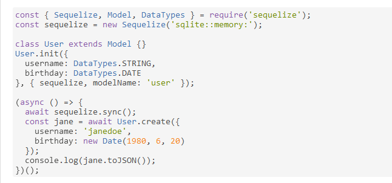

## sql vs nosql(Video), nosql vs sql, sql modeling techniques, sequelize api

### sql vs nosql(Video):
| SQL | NOSQL |
| ------  |  ------ |
| Stcutued query language | nonue structred query language|
| ------  |  ------ |
| Relational Databases | No relation |
| ------  |  ------ |
| allows the database engine to guarantee consistency based on that design |  lower consistency of information |
| ------  |  ------ |
|  table based databases |  key-value pairs |
| ------  |  ------ |
| predefined schema | dynamic schema  |
| ------  |  ------ |
| MySql, Oracle, Sqlite, Postgres and  | MongoDB, BigTable, Redis, RavenDb  |
| ------  |  ------ |

### Sql modeling techniques

Its create diagrams of the database tables and their relationships

Diagrams based on:
 * Data Modeling – Table Elements: it contain a table name primary key , tables m Columns and forign key.
 * Data Modeling – Table Relationships: It's a connect lines between tables to show relationships. and it consider of  one-to-many relationship, one-to-one and many to many.

### Sequelize:

is a promise-based Node.js ORM tool for Postgres, MySQL, and others.

[Home](README.md)