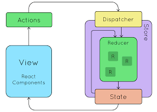

# Application State with Redux

Redux provides a solid, stable, and mature solution to managing state in your React application.

It helps you write applications that behave consistently.

Redux takes away some of the hassles faced with state management in large applications. You may also have a lot of data changing in your application over time. Redux helps solve these kinds of problems.

If you want to update the state of your Redux application , you need to let Redux know about that with an action then send the action to the reducers.

Reducers are the most important concept in Redux. So, what’s the deal with the Reducer. In more technical terms, a reducer is also called a reducing function.

[Home](../README.md)